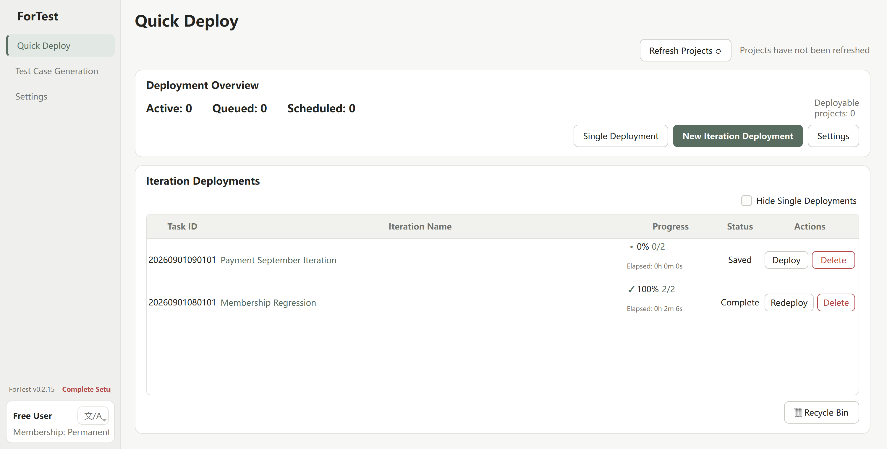
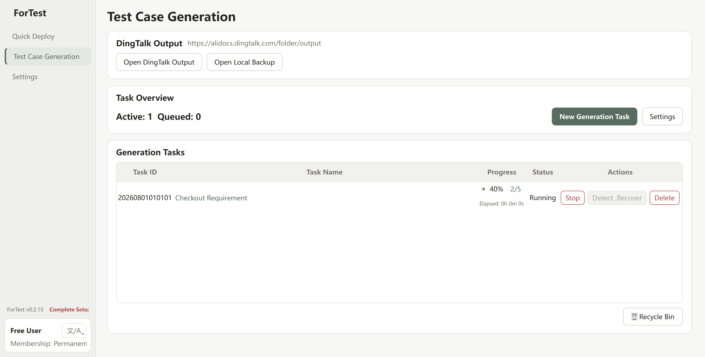
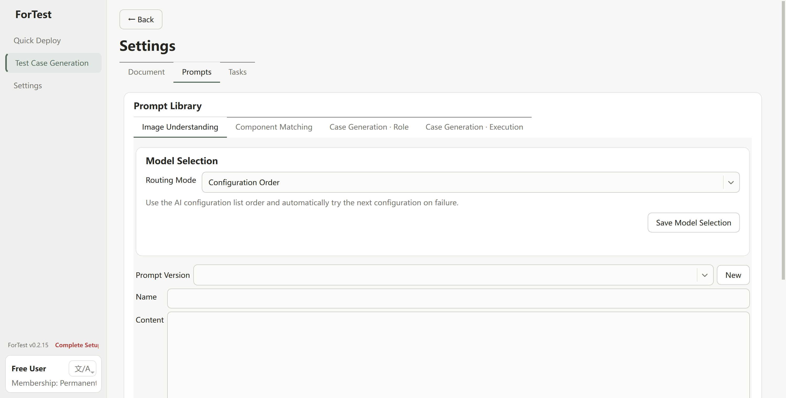
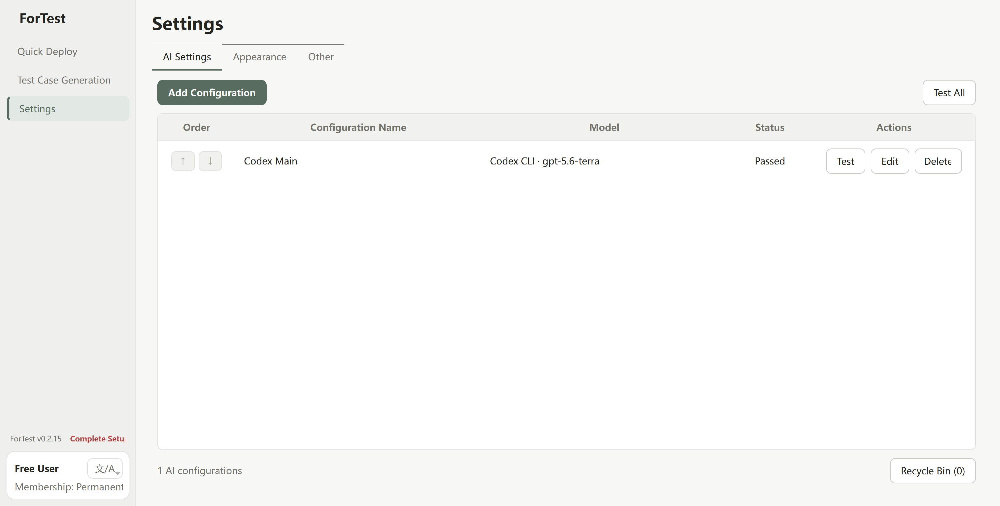
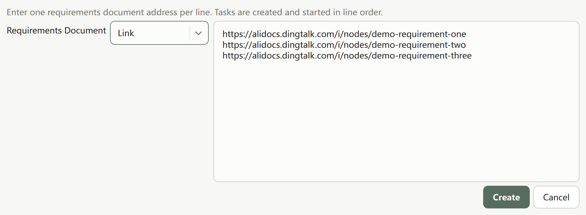
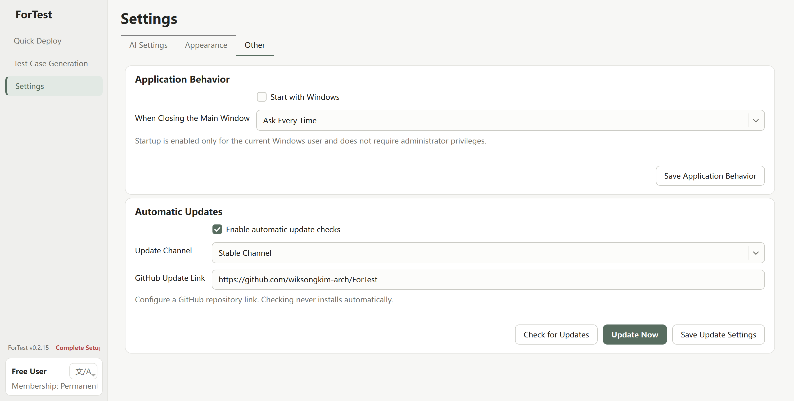

English | [简体中文](./README.md)

# ForTest

A native Windows desktop tool developed with the assistance of Codex for software test engineers, focused on streamlined Jenkins deployment and high-quality test case generation.

[Download the latest release](https://github.com/wiksongkim-arch/ForTest/releases/latest) · [Report an issue](https://github.com/wiksongkim-arch/ForTest/issues) · [Contribute](CONTRIBUTING.md) · [Report a security issue](SECURITY.md)

## Introduction

ForTest is a Windows desktop tool developed with the assistance of Codex for software test engineers. It turns repetitive and fragmented testing work into clear, reusable, and traceable workflows, reducing the need to switch repeatedly among requirement documents, models, test case templates, and deployment platforms.

The current release is a fully native Windows x64 desktop application. It does not depend on a browser interface and does not start Streamlit, FastAPI, or a local web service. It currently contains two core modules: **Jenkins Quick Deploy** and **Test Case Generation**.

## v0.2.15 Highlights

- Quick Deploy now offers Save Only and Create & Deploy. Redeploying appends a new execution run to the original task, preserving its task ID and distinguishable run history.
- Test Case Generation accepts multiple requirement links, one per line, in a wider scrollable editor. The full batch is validated before tasks are created and started in input order.
- Appearance is now the second tab under Settings, immediately after AI Settings, which keeps the sidebar focused.
- Other Settings now provides automatic GitHub Release checks, Check for Updates, and Update Now. Before an installer starts, ForTest validates the source host, file size, SHA-256, and Windows x64 PE architecture.

## Core Capabilities

### Jenkins Quick Deploy

Built on the Jenkins REST API and parameterized Pipeline jobs, this module uses the test environment as its primary organizational dimension. Multiple projects and their target branches can be grouped into one iteration and deployed immediately or on a schedule. Deployment subtasks within the same iteration are submitted to the Jenkins queue in parallel, while separate iteration tasks run in sequence to improve efficiency without losing predictable iteration order.

The module brings together Jenkins connections and project configuration, single deployments, iteration deployments, save-only drafts, scheduling, task queues, status tracking, same-task redeployment, per-run history, task cancellation, and recycle-bin management. It is designed to remove the repetitive work of opening Jenkins, selecting parameters, triggering jobs one by one, and continuously checking results across multiple clients, projects, and branches.

### Staged Test Case Generation

Following a real-world test case authoring process, generation is organized into stages such as **requirement decomposition, image understanding, component matching, case generation, and template-based output**. Large illustrated requirements are split by heading hierarchy and safe processing boundaries, preserving context and image associations while each section is handled. Every AI stage can use its own prompt, model, and parameters, together with team-specific field rules and reusable test case component templates.

This staged and constraint-driven approach is intended to reduce context omissions, model hallucinations, and format drift that may occur when an entire large illustrated requirement is sent directly to a single agent. The system supports line-based batch task creation, FIFO scheduling, parallel tasks, lifecycle status management, local result backups, and online document output. With suitable source requirements, model capabilities, template configuration, and human review, it can support output at the scale of thousands of test cases, with the goal of producing broad coverage, executable steps, maintainable content, and consistent formatting.

The current release primarily uses **document MCP integration** for online documents and provides focused support for **Codex CLI** discovery, configuration, model selection, and runtime version management. Additional document platforms and model integrations will be added gradually. Refer to each Release and the in-app connection checks for the currently supported scope.

## Codex Skill Validation and Roadmap

In addition to the two modules already delivered in the desktop application, the project has validated several testing workflows in Codex Skill form. The capabilities below may be productized gradually according to stability and real-world feedback; **they are not currently bundled as stable features in the latest desktop Release**:

1. **Reverse requirement completion**: infer and complete missing requirement descriptions and acceptance criteria using existing implementations, test materials, and business context.
2. **Requirement analysis and gap detection**: inspect coverage, boundary conditions, error scenarios, roles and permissions, ambiguities, and contradictions across a requirement.
3. **Production issue diagnosis bot**: organize symptoms, logs, environments, and historical information into a structured investigation path that helps identify likely causes and verification steps.
4. **Automated test case execution**: explore connecting structured test cases to automation tools and collecting execution status, evidence, and results.
5. **More end-to-end testing capabilities**: including additional platform integrations, local-code-based requirement analysis, requirement research and archiving, local project code management, and database management.

This roadmap describes the current direction of exploration and is not a commitment to a specific version, release date, or delivery scope.

## Engineering and Usability

- Native Qt desktop experience with system, light, and dark appearance modes.
- Instant switching among Simplified Chinese, Traditional Chinese, and English.
- Configuration, task history, logs, and generated files are stored under `%LOCALAPPDATA%\ForTest\UserData` instead of the installation directory.
- Secrets are stored separately from ordinary settings, and credentials are redacted from logs and error messages.
- Built-in task queues, recycle bins, actionable error messages, and recoverable data migration.
- Configurable GitHub Release update checks; downloading and installation always require an explicit user action.
- The installer includes application dependencies and the Codex CLI runtime, so end users do not need to configure Python.

## Quick Start

### System Requirements

- Windows 10 version 1809 or later, or Windows 11
- 64-bit operating system (x64)
- A reachable Jenkins service and an account with the required permissions for Jenkins features
- Network access and valid credentials for the relevant document and model services

### Installation and First Use

1. Open [GitHub Releases](https://github.com/wiksongkim-arch/ForTest/releases/latest) and download `ForTest-Windows-x64-Setup-0.2.15.exe`.
2. Compare the file against the SHA-256 value on the Release page, then run the installer. ForTest installs to the current user's directory by default and does not require administrator privileges.
3. Start ForTest and complete the required setup shown on the home screen:
   - Quick Deploy: enter the Jenkins URL, username, and API Token, then test the connection.
   - Test Case Generation: configure the document MCP, output destination, models, and prompts. When using Codex CLI, follow the in-app guidance to sign in or select a runtime.
4. Return to the relevant workspace and create a deployment task or test case generation task.

> The current public installer is not signed with an Authenticode certificate, so Windows may display an application reputation warning. Download it only from this repository's Releases and verify its SHA-256 first. Do not run a file whose source or digest does not match.

## Interface Preview

### Jenkins Quick Deploy

Refresh projects, run single or iteration deployments, schedule tasks, and track execution status.



### Staged Test Case Generation

The generation page provides direct access to online output, local backups, the task queue, and the recycle bin.



Each processing stage can use its own model, prompt version, and test case component template, allowing a team's methodology to become a reusable workflow.



### AI and Runtime Settings

Manage model configurations, Codex CLI sources and versions, models, and reasoning parameters in one place, with individual connection checks.



### Batch Tasks and Application Updates

Link mode accepts multiple requirements-document addresses, one per line. Tasks are created and started in input order, and the editor scrolls both horizontally and vertically.



Appearance now lives in Settings immediately after AI Settings. The Other tab can target a GitHub repository and either check for or immediately install a Release update.



> Preview images use demonstration or redacted data. Before attaching an image to an Issue, remove document links, accounts, tokens, local paths, and business data.

## Current Limitations

- Only a Windows x64 desktop edition is currently available; macOS, Linux, ARM64, and web editions are not supported.
- **EIM monitoring is not released**: the execution plan requires a hard gate proving that messages sent by the currently signed-in user are returned completely. In the official DWS v1.0.60 [event monitoring reference](https://github.com/DingTalk-Real-AI/dingtalk-workspace-cli/blob/v1.0.60/skills/mono/references/products/event.md), self-sent messages are filtered by `isSelfLoop`. Under the plan's No-Go rule, this release therefore includes no EIM UI, background engine, or polling workaround.
- Online requirements currently use the document MCP workflow; other collaboration platforms have not yet been released as stable capabilities.
- Codex CLI is the primary model invocation path currently under focused validation. Treat other models and compatible interfaces according to their in-app check results.
- Jenkins, document platform, and model operations remain subject to the permissions, network access, certificates, and quotas of those external services.
- Generated test cases assist analysis and must still be reviewed by a test engineer against the actual requirement before release or execution.

## Repository Structure

| Path | Description |
| --- | --- |
| `windows_native/` | Native Qt desktop application, Jenkins module, UI components, runtime management, tests, PyInstaller configuration, and Inno Setup installer scripts. |
| `backend/` | Shared business core for AI configuration, prompts, generation workflows, settings models, and security validation. |
| `services/` | Integrations for document MCP, spreadsheet output, and requirement document processing. |
| `utils/` | Shared utilities such as Excel output and default template loading. |
| `tests/` | Unit, integration, security, and regression tests for the shared business core. |
| `windows_native/tests/` | Tests for the native desktop application, Jenkins integration, task scheduling, startup flow, and offscreen UI. |
| `windows_native/assets/` | Application icons and bundled templates that are licensed for redistribution. |
| `png/` | Redacted interface previews used by the Chinese and English READMEs. |
| `.github/` | Issue and Pull Request templates plus Windows CI workflows. |
| `docs/` | Long-lived security, privacy, and source publication documentation for maintainers. |
| `scripts/` | Maintenance utilities such as data migration scripts. |

Build artifacts, virtual environments, user configuration, logs, one-off validation records, and development assistant files are ignored by Git and are not part of the published source package.

## Development, Testing, and Packaging

Run the complete build in a 64-bit Windows PowerShell session:

```powershell
powershell -ExecutionPolicy Bypass -File windows_native\build.ps1
```

The build script creates an isolated environment and then performs:

1. Source privacy gate;
2. Native desktop and offscreen UI tests;
3. Shared business core regression tests;
4. Windows x64 application packaging and PE architecture checks;
5. Artifact privacy gate and packaged startup diagnostics;
6. Inno Setup installer generation.

The resulting installer is written to `windows_native/dist/installer/`. See [`docs/security/package-privacy.md`](docs/security/package-privacy.md) for the privacy boundaries covering runtime data, installer contents, and the public repository.

## Source Availability and Collaboration

ForTest welcomes contributions within clearly defined boundaries:

- Use [GitHub Issues](https://github.com/wiksongkim-arch/ForTest/issues) to report reproducible problems or suggest improvements. Do not attach real credentials, private documents, or internal service addresses.
- Before contributing code, read [`CONTRIBUTING.md`](CONTRIBUTING.md) and [`CODE_OF_CONDUCT.md`](CODE_OF_CONDUCT.md). Keep changes focused and include the relevant tests and localized UI text.
- Whenever `README.md` or `README.en.md` changes, update the other language in the same commit and verify the matching screenshots, links, and capability boundaries.
- Report security vulnerabilities through the private channel described in [`SECURITY.md`](SECURITY.md), rather than disclosing them first in a public Issue.
- Pull Requests and pushes to `main` run the privacy gate and both regression test suites on Windows.

This project's source is published under the [PolyForm Noncommercial License 1.0.0](LICENSE). Personal learning, research, testing, and other noncommercial uses are permitted, as are modification and distribution within the same noncommercial boundary. Commercial use, commercial integration, or redistribution for a commercial purpose requires separate written permission from `wiksongkim-arch`. Third-party dependencies, fonts, icons, and templates remain subject to their respective licenses.

ForTest is therefore a **source-available** project, not open-source software under the OSI definition. Before downloading, using, or distributing it, refer to the complete [`LICENSE`](LICENSE) text in this repository.
