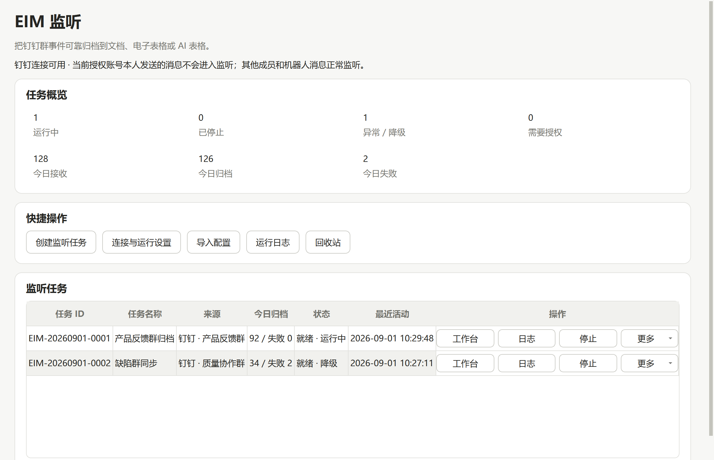
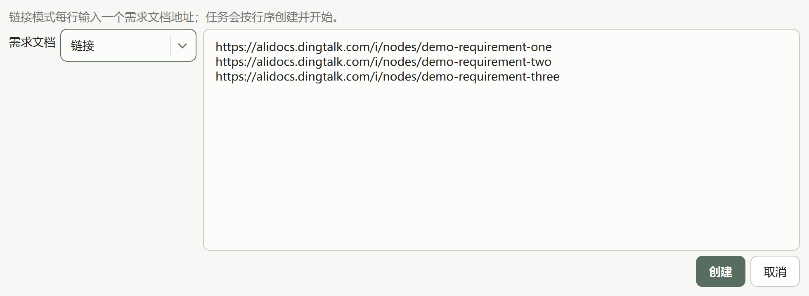
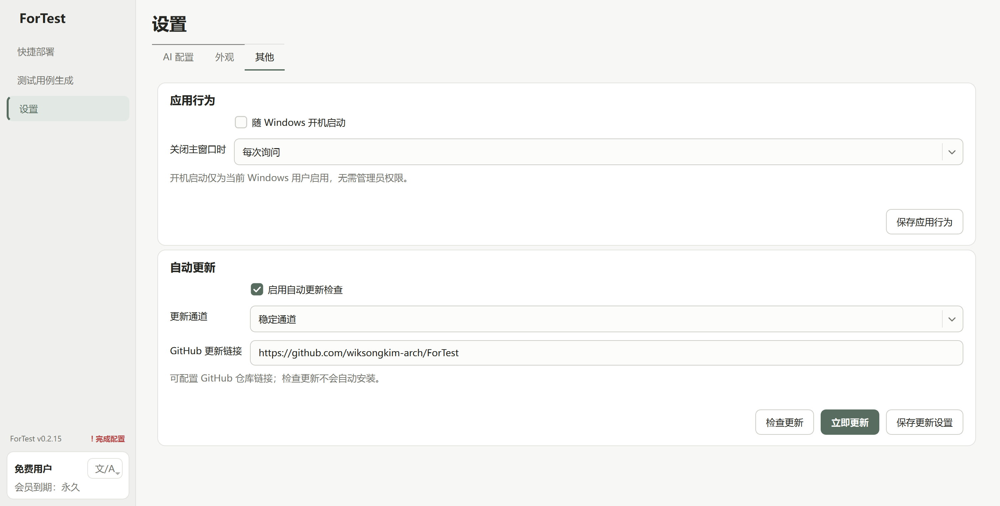

[English](./README.en.md) | 简体中文

# ForTest

由 Codex 协助开发、面向软件测试工程师的 Windows 桌面工具，聚焦 Jenkins 快捷部署、高质量测试用例生成与钉钉事件归档。

[下载最新版本](https://github.com/wiksongkim-arch/ForTest/releases/latest) · [提交问题](https://github.com/wiksongkim-arch/ForTest/issues) · [参与贡献](CONTRIBUTING.md) · [安全报告](SECURITY.md)

## 简介

ForTest 是一款使用 Codex 参与开发、面向软件测试工程师的 Windows 桌面端工具。项目希望把重复、分散的测试工作沉淀为清晰、可复用、可追踪的标准流程，减少测试人员在需求文档、模型、用例模板和部署平台之间反复切换的成本。

当前版本为纯 Windows x64 桌面应用，不依赖浏览器界面，也不会启动 Streamlit、FastAPI 或本地 Web 服务；目前包含 **Jenkins 快捷部署**、**测试用例生成**，以及默认关闭的 **EIM 监听内部试运行模块**。

## v0.2.16 更新摘要

- 新增 EIM 监听内部试运行能力（默认关闭）：通过隔离的 DWS v1.0.60 连接钉钉群，将文本、媒体、引用和 Reaction 事件幂等归档到文档、电子表格或 AI 表格；提供任务工作台、不可变版本、断线补偿、日志、回收站和可选 AI 增强。
- 快捷部署支持“仅保存”和“创建并部署”；重新部署会在原任务上追加新的执行批次，任务 ID 不变，历次部署记录可区分并完整保留。
- 测试用例生成支持在宽版可滚动输入框中按行粘贴多个需求链接，系统会整体校验后按输入顺序创建并启动任务。
- 外观设置已合并到“设置”页面，并位于“AI 配置”之后；侧栏入口更精简。
- “其他”设置新增 GitHub Release 自动检查、“检查更新”和“立即更新”。安装包启动前会校验来源域、文件大小、SHA-256 与 Windows x64 PE 架构。
- 新增桌面进程生命周期诊断：记录托盘、窗口、系统会话和更新安装触发的退出原因，并通过 30 秒心跳与上次未正常结束标记辅助排查无操作自动退出现象；异常内容写入前会脱敏。

## 核心能力

### Jenkins 快捷部署

基于 Jenkins REST API 与参数化 Pipeline 任务，将测试环境作为主要组织维度，可在同一个迭代中组合多个项目及各自的目标分支，并按需立即执行或定时部署。同一迭代中的部署子任务会并行提交至 Jenkins 队列，不同迭代任务则保持顺序执行，在兼顾效率的同时避免迭代之间相互抢占执行顺序。

模块集中提供 Jenkins 连接与项目配置、单点部署、迭代部署、仅保存、定时执行、任务排队、状态跟踪、同任务重新部署、分批历史、停止任务和回收站管理，主要解决多端、多项目、多分支场景下反复进入 Jenkins 手工选择参数、逐项触发和持续查看结果的繁琐问题。

### 分步测试用例生成

参照真实测试用例编写流程，将任务组织为**需求拆分、图片理解、组件匹配、用例生成和模板化输出**等阶段。大型图文需求会按标题层级和安全边界拆分，在保留上下文与图片关系的前提下逐块处理；不同 AI 步骤可分别配置 Prompt、模型和参数，并结合团队的字段规范与用例组件模板生成结果。

这种分步、可约束的生成方式，用于改善将整份大型图文需求直接交给单个 Agent 时可能出现的上下文遗漏、模型幻觉和输出规范漂移问题。系统支持按行批量创建链接任务、先进先出调度、任务并行、过程状态管理、本地结果备份以及在线文档输出；在需求质量、模型能力、模板配置和人工验收均满足要求时，可支撑千条级用例产出，目标是获得高覆盖度、可执行、可维护且格式统一的测试用例。

当前版本以**文档 MCP 接入**为主要在线文档通道，并对 **Codex CLI** 的发现、配置、模型选择和运行时版本管理进行了重点适配。更多文档平台和模型接入仍会逐步完善，请以每个 Release 的说明和应用内检测结果为准。

### EIM 监听

> EIM 尚待独立测试组织完成真实 G0 验收，公开构建默认不显示入口，也不会启动监听后台。仅受控试运行可在启动前设置 `FORTEST_ENABLE_EIM=1`；移除该变量或设为 `0` 后重启即可关闭。

EIM 监听使用固定校验、独立配置目录的 DWS v1.0.60 接收钉钉群事件。事件经过标准化、去重、受限 EIM DSL 规则和有界重试后，可写入钉钉文档、电子表格或 AI 表格；提交状态不确定时会先回读幂等标记，不能可靠补偿的断线缺口会明确进入降级状态。

任务支持结构化规则与字段映射、脱敏样例测试、不可变版本、日志导出、配置导入导出、回收站、托盘持续运行和开机恢复。确定性任务不调用 AI；可选 AI 构建和运行步骤只使用已登记动作、明确输入字段、日预算与失败策略。连接、权限、self-loop 范围、成本和故障排查详见 [EIM 监听使用指南](docs/eim-monitoring.md)。

## Codex Skill 验证与后续计划

除当前桌面版已经交付的三大模块外，项目还在 Codex Skill 形态下跑通了部分测试工作流验证。以下能力将根据稳定性和实际使用反馈逐步产品化，**目前不代表已经内置于最新桌面版 Release**：

1. **逆向需求补全**：结合既有实现、测试材料和业务上下文，反向整理并补充缺失的需求说明与验收条件。
2. **需求分析与查漏补缺**：检查需求覆盖范围、边界条件、异常场景、角色权限以及前后描述中的歧义或冲突。
3. **线上问题排查机器人**：围绕问题现象、日志、环境和历史信息形成结构化排查路径，辅助定位可能的原因与验证方式。
4. **自动化执行测试用例**：探索将结构化测试用例衔接到自动化执行工具，并回收执行状态、证据和结果。
5. **更多测试全流程能力**：包括更多平台适配、基于本地代码的需求分析、需求调研与归档、本地项目代码管理和数据库管理等方向。

路线图用于说明当前探索方向，不构成具体版本、发布时间或交付范围承诺。

## 工程与使用特点

- Qt桌面体验，支持跟随系统、浅色和深色外观。
- 简体中文、繁体中文和英文界面可即时切换。
- 配置、任务记录、日志和生成文件统一保存在 `%LOCALAPPDATA%\ForTest\UserData`，不写入安装目录。
- 密钥与普通配置分离保存，日志和错误信息会执行凭据脱敏。
- 内置任务队列、回收站、异常提示和可恢复的数据迁移机制。
- 生命周期日志会记录窗口/托盘退出路径、系统会话结束、事件循环返回和脱敏异常，并以心跳识别上次运行是否意外中断。
- 可配置 GitHub 仓库的 Release 更新检查；下载和安装始终需要用户明确触发。
- 安装包内置运行依赖、Codex CLI 与固定校验的 DWS v1.0.60，普通用户无需配置 Python 或全局 DWS 环境。

## 快速开始

### 系统要求

- Windows 10 1809 或更高版本、Windows 11
- 64 位操作系统（x64）
- 使用 Jenkins 功能时，需要可访问的 Jenkins 服务及具备相应权限的账号
- 使用在线文档和模型能力时，需要对应服务的网络访问条件与合法凭据
- 受控试运行 EIM 时，需要先设置 `FORTEST_ENABLE_EIM=1`，并使用可完成官方 OAuth/扫码授权、可查看来源群且可读写归档目标的钉钉测试账号

### 安装与首次使用

1. 打开 [GitHub Releases](https://github.com/wiksongkim-arch/ForTest/releases/latest)，下载 `ForTest-Windows-x64-Setup-0.2.16.exe`。
2. 对照 Release 页面提供的 SHA-256 校验值确认文件完整性，然后运行安装程序。ForTest 默认安装到当前用户目录，不要求管理员权限。
3. 启动 ForTest，根据首页配置状态完成必要设置：
   - 快捷部署：填写 Jenkins 地址、用户名与 API Token，并检测连接。
   - 测试用例生成：配置文档 MCP、输出位置、模型和提示词；使用 Codex CLI 时按应用提示完成登录或运行时选择。
   - EIM 监听（受控试运行）：启动前设置 `FORTEST_ENABLE_EIM=1`，再进入“连接与运行设置”完成钉钉官方授权并确认群发现与事件能力通过。
4. 返回对应工作区，新建部署任务、测试用例生成任务或监听任务。

> 当前公开安装包尚未进行商业代码签名，Windows 可能显示应用信誉提示。请只从本仓库 Releases 下载，并先核对 Release 中的 SHA-256；来源或摘要不一致时不要运行。

## 界面预览

### Jenkins 快捷部署

支持项目刷新、单点部署、迭代部署、定时任务和执行状态跟踪。


### 分步测试用例生成

生成页集中展示在线输出、本地备份、任务队列和回收站入口。


不同处理步骤可分别配置模型、提示词版本和用例组件模板，便于将团队方法沉淀为可复用流程。


### AI 与运行时配置

统一管理模型配置、Codex CLI 来源与版本、模型以及推理参数，并可逐项检测连接状态。


### EIM 监听

总览集中展示连接边界、运行指标、任务状态与治理操作；任务工作台用于测试规则、发布不可变版本并显式启动。



### 批量任务与应用更新

链接模式支持按行输入多个需求文档地址；任务会按输入顺序创建并启动，输入区可横向和纵向滚动。



“外观”已合并到“设置”，位于“AI 配置”之后；“其他”页可配置 GitHub 仓库并手动检查或立即安装 Release 更新。



> 预览图使用演示或脱敏信息。提交 Issue 或截图前，也请移除文档链接、账号、Token、本机路径及业务数据。

## 当前能力边界

- 仅提供 Windows x64 桌面版本，暂不支持 macOS、Linux、ARM64 或 Web 端。
- EIM 首版仅支持钉钉。官方 DWS v1.0.60 会按 `isSelfLoop` 过滤当前 OAuth 授权账号本人发送的消息；ForTest 在界面持续明示这一范围，也不会以轮询或私有接口绕过。其他成员和机器人消息正常监听。
- 在线需求文档目前以文档 MCP 工作流为主，其他协作平台尚未作为稳定能力发布。
- Codex CLI 是当前重点验证的模型调用方式；其他模型或兼容接口应以应用内检测结果为准。
- ForTest 调用 Jenkins、文档平台和模型服务时，仍受外部服务权限、网络、证书和配额限制。
- 自动生成的测试用例用于辅助分析，发布或执行前仍应由测试人员结合真实需求复核。

## 目录说明

| 路径 | 说明 |
| --- | --- |
| `windows_native/` | Qt桌面端、Jenkins 模块、界面组件、运行时管理、测试、PyInstaller 配置和 Inno Setup 安装器脚本。 |
| `backend/` | AI 配置、提示词、生成流程、EIM 事件引擎、设置模型与安全校验等共享业务核心。 |
| `services/` | 文档 MCP、表格输出和需求文档处理等外部服务适配。 |
| `utils/` | Excel 写入、默认模板加载等通用工具。 |
| `tests/` | 共享业务核心的单元、集成、安全和回归测试。 |
| `windows_native/tests/` | 桌面端、Jenkins、任务调度、启动流程和离屏 UI 测试。 |
| `windows_native/assets/` | 应用图标及可合法分发的内置模板。 |
| `png/` | 中英文 README 使用的脱敏界面预览图。 |
| `.github/` | Issue/PR 模板与 Windows CI 工作流。 |
| `docs/` | EIM 使用指南，以及面向维护者长期有效的安全、隐私和源码发布规范。 |
| `scripts/` | 数据迁移等维护脚本。 |

构建产物、虚拟环境、用户配置、日志、一次性验收记录和开发助手临时文件均被 Git 忽略，不属于公开源码交付内容。

## 开发、测试与打包

在 64 位 Windows PowerShell 中执行完整构建：

```powershell
powershell -ExecutionPolicy Bypass -File windows_native\build.ps1
```

构建脚本会创建隔离环境并依次完成：

1. 源码隐私门禁；
2. 桌面端及离屏 UI 测试；
3. 共享业务核心回归测试；
4. Windows x64 程序打包与 PE 架构检查；
5. 产物隐私门禁和打包后启动诊断；
6. Inno Setup 安装包生成。

最终安装包位于 `windows_native/dist/installer/`。运行时数据、安装包内容和公开仓库的隐私边界参见 [`docs/security/package-privacy.md`](docs/security/package-privacy.md)。

## 源码公开与协作

ForTest 欢迎在明确边界内参与改进：

- 使用 [GitHub Issues](https://github.com/wiksongkim-arch/ForTest/issues) 报告可复现的问题或提出建议；请勿附带真实凭据、私有文档或内部服务地址。
- 提交代码前请阅读 [`CONTRIBUTING.md`](CONTRIBUTING.md) 和 [`CODE_OF_CONDUCT.md`](CODE_OF_CONDUCT.md)，保持改动聚焦，并补充相应测试与多语言文案。
- 修改 `README.md` 或 `README.en.md` 时，必须在同一次提交中同步更新另一语言版本，并核对对应语言的界面截图、链接和能力边界。
- 安全漏洞请按 [`SECURITY.md`](SECURITY.md) 提供的私密渠道报告，不要先在公开 Issue 中披露。
- Pull Request 和 `main` 分支推送会在 Windows 环境执行隐私门禁及两组回归测试。

本项目依据 [PolyForm Noncommercial License 1.0.0](LICENSE) 公开源码，允许个人学习、研究、测试及其他非商业用途，也允许在相同非商业边界内修改和分发。任何商业使用、商业集成或以商业目的再分发，均须事先取得 `wiksongkim-arch` 的单独书面许可。第三方依赖、字体、图标和模板仍分别受其自身许可约束。

因此，ForTest 属于 **source-available（源码公开）** 项目，而不是 OSI 定义的开源软件。下载、使用或分发前，请以仓库中的完整 [`LICENSE`](LICENSE) 文本为准。
